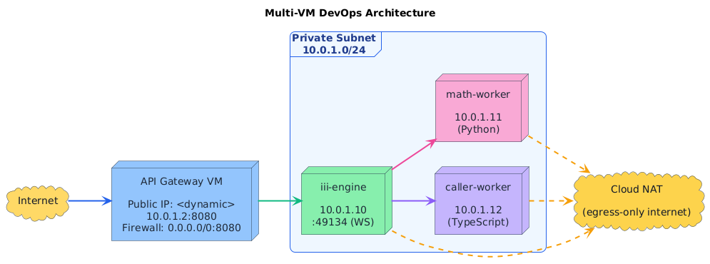

# iii Quickstart - Distributed Multi-VM Deployment

DevOps internship assignment: Deploy the iii quickstart project across multiple VMs in a private GCP subnet with RPC-based worker communication and HTTP JSON API gateway.

## Architecture



## RPC Flow

1. **HTTP Request** → API Gateway `:8080/math/add` `{"a": 5, "b": 3}`
2. **API Gateway** → Connects to iii-engine at `ws://10.0.1.10:49134`
3. **API Gateway** → Triggers `math::add_two_numbers` on engine
4. **iii-engine** → Routes to `caller-worker` (TypeScript) at `10.0.1.12`
5. **caller-worker** → Calls `math::add` via engine
6. **iii-engine** → Routes to `math-worker` (Python) at `10.0.1.11`
7. **math-worker** → Executes `a + b`, returns `{"c": 8}` via engine
8. **caller-worker** → Receives result, adds success message, returns via engine
9. **API Gateway** → Receives final result
10. **HTTP Response** → `{"c": 8, "success": "Workers are interoperating..."}`

## Components

| Component        | VM            | Private IP  | Public IP | Port  | Language   | Purpose                           |
|------------------|---------------|-------------|-----------|-------|------------|-----------------------------------|
| API Gateway      | `api-gateway` | 10.0.1.2    | Yes       | 8080  | TypeScript | HTTP JSON endpoint                |
| iii Engine       | `iii-engine`  | 10.0.1.10   | No        | 49134 | -          | WebSocket RPC coordinator         |
| Math Worker      | `math-worker` | 10.0.1.11   | No        | -     | Python     | Executes `math::add(a, b) → c`    |
| Caller Worker    | `caller-worker` | 10.0.1.12 | No        | -     | TypeScript | Calls `math::add` via engine      |

## Prerequisites

1. **GCP Account** with $300 free credits or existing project
2. **Tools installed**:
   - `gcloud` CLI ([install](https://cloud.google.com/sdk/docs/install))
   - `terraform` >= 1.0 ([install](https://developer.hashicorp.com/terraform/downloads))
3. **GCP Project** created (note the project ID)

## Deployment Instructions

### 1. Clone Repository
```bash
git clone <your-repo-url>
cd alchemystai
```

### 2. Authenticate with GCP
```bash
gcloud auth login
gcloud config set project <YOUR_PROJECT_ID>
```

### 3. Deploy Infrastructure
```bash
./deploy.sh <YOUR_PROJECT_ID>
```

This script will:
- Enable required GCP APIs (Compute Engine, Resource Manager)
- Initialize Terraform
- Create VPC, subnet, firewall rules, Cloud NAT
- Provision 4 VMs with startup scripts
- Configure systemd services for all workers and API gateway
- Output the public IP of the API gateway

**Expected duration**: 5-7 minutes

### 4. Verify Deployment

Wait ~2 minutes after deployment for all services to start, then test:

```bash
# Get API Gateway IP from Terraform output
cd terraform
API_IP=$(terraform output -raw api_gateway_public_ip)

# Test the API
curl -X POST http://$API_IP:8080/math/add \
  -H "Content-Type: application/json" \
  -d '{"a": 5, "b": 3}'
```

**Expected Response**:
```json
{
  "c": 8,
  "success": "Workers are interoperating across VMs via RPC through the iii engine"
}
```

### 5. Health Check
```bash
curl http://$API_IP:8080/health
```

**Expected Response**:
```json
{
  "status": "healthy",
  "engine": "ws://10.0.1.10:49134"
}
```

## Debugging

### SSH into VMs (via IAP)
```bash
gcloud compute ssh iii-engine --zone=us-central1-a --tunnel-through-iap
gcloud compute ssh math-worker --zone=us-central1-a --tunnel-through-iap
gcloud compute ssh caller-worker --zone=us-central1-a --tunnel-through-iap
gcloud compute ssh api-gateway --zone=us-central1-a --tunnel-through-iap
```

### Check Service Status
```bash
# On each VM
sudo systemctl status iii-engine.service
sudo systemctl status math-worker.service
sudo systemctl status caller-worker.service
sudo systemctl status api-gateway.service

# View logs
sudo journalctl -u <service-name> -f
```

### Check Startup Logs
```bash
cat /var/log/startup.log
```

## Teardown

To destroy all infrastructure:
```bash
./destroy.sh <YOUR_PROJECT_ID>
```

This removes:
- All 4 VMs
- VPC and subnet
- Firewall rules
- Cloud NAT and router

## Network Security

✅ **Implemented**:
- Worker VMs have **no public IPs** (isolated in private subnet)
- Only API Gateway has public IP with firewall rule allowing `:8080`
- Cloud NAT enables egress-only internet for package installation
- SSH access via IAP tunnel only (no direct SSH from internet)
- Firewall rules restrict engine WS port (49134) to subnet only

🔒 **Firewall Rules**:
| Rule                 | Source         | Target          | Port  | Purpose                    |
|----------------------|----------------|-----------------|-------|----------------------------|
| `allow-api-http`     | 0.0.0.0/0      | api-gateway     | 8080  | Public HTTP access         |
| `allow-engine-internal` | 10.0.1.0/24 | iii-engine      | 49134 | Internal RPC only          |
| `allow-ssh-iap`      | 35.235.240.0/20| all VMs         | 22    | SSH via IAP for debugging  |
| `allow-internal`     | 10.0.1.0/24    | 10.0.1.0/24     | all   | VM-to-VM communication     |

## API Schema

### Endpoint: `POST /math/add`

**Request**:
```json
{
  "a": <number>,
  "b": <number>
}
```

**Response**:
```json
{
  "c": <number>,
  "success": <string>
}
```

**Example**:
```bash
curl -X POST http://<API_IP>:8080/math/add \
  -H "Content-Type: application/json" \
  -d '{"a": 42, "b": 8}'

# Response:
# {"c": 50, "success": "Workers are interoperating across VMs via RPC through the iii engine"}
```

**Error Responses**:
```json
// 400 Bad Request (invalid input)
{"error": "Invalid input: a and b must be numbers"}

// 404 Not Found (invalid route)
{"error": "Not found"}

// 500 Internal Server Error (worker failure)
{"error": "Internal server error", "message": "<details>"}
```

> **Note**: For detailed production hardening requirements and scaling strategy for 100x larger models, see [PRODUCTION_HARDENING.md](PRODUCTION_HARDENING.md)

## File Structure

```
.
├── README.md                    # This file
├── ARCHITECTURE.md              # Detailed architecture design
├── deploy.sh                    # One-command deployment script
├── destroy.sh                   # One-command teardown script
├── terraform/
│   ├── main.tf                  # VPC, subnet, NAT, firewall rules
│   ├── compute.tf               # VM instances
│   ├── variables.tf             # Input variables
│   └── outputs.tf               # API IP and test command
├── scripts/
│   ├── engine-startup.sh        # iii engine VM initialization
│   ├── math-worker-startup.sh   # Python worker VM initialization
│   ├── caller-worker-startup.sh # TypeScript worker VM initialization
│   └── api-gateway-startup.sh   # API gateway VM initialization
└── quickstart/                  # Original iii template (reference)
    ├── README.md
    ├── config.yaml
    └── workers/
        ├── math-worker/
        │   ├── math_worker.py
        │   └── requirements.txt
        └── caller-worker/
            ├── src/worker.ts
            ├── package.json
            └── tsconfig.json
```

## Troubleshooting

### Issue: API returns 500 error

**Check**:
1. Verify all services are running:
   ```bash
   gcloud compute ssh iii-engine --zone=us-central1-a --tunnel-through-iap
   sudo systemctl status iii-engine.service
   ```
2. Check engine logs: `sudo journalctl -u iii-engine.service -n 50`
3. Verify workers are connected to engine
4. Check firewall rules allow port 49134 from subnet

### Issue: Workers not connecting to engine

**Check**:
1. Verify engine is listening: `sudo netstat -tlnp | grep 49134`
2. Check worker environment variables: `systemctl show caller-worker.service | grep Environment`
3. Ping engine from worker: `ping 10.0.1.10`
4. Test WebSocket connection: `curl http://10.0.1.10:49134` (should return WS upgrade error)

### Issue: Cannot SSH into VMs

**Solution**:
```bash
# Ensure IAP tunnel is enabled
gcloud compute firewall-rules list | grep ssh-iap

# Use IAP tunnel
gcloud compute ssh <vm-name> --zone=us-central1-a --tunnel-through-iap
```

### Issue: VMs cannot install packages

**Check**:
1. Cloud NAT is running: `gcloud compute routers nats list --router=iii-nat-router --region=us-central1`
2. Test internet from VM: `curl -I https://google.com`

## Author

Nabiel M

**Contact**: msyednabiel@gmail.com

**Submitted**: May 23, 2026
